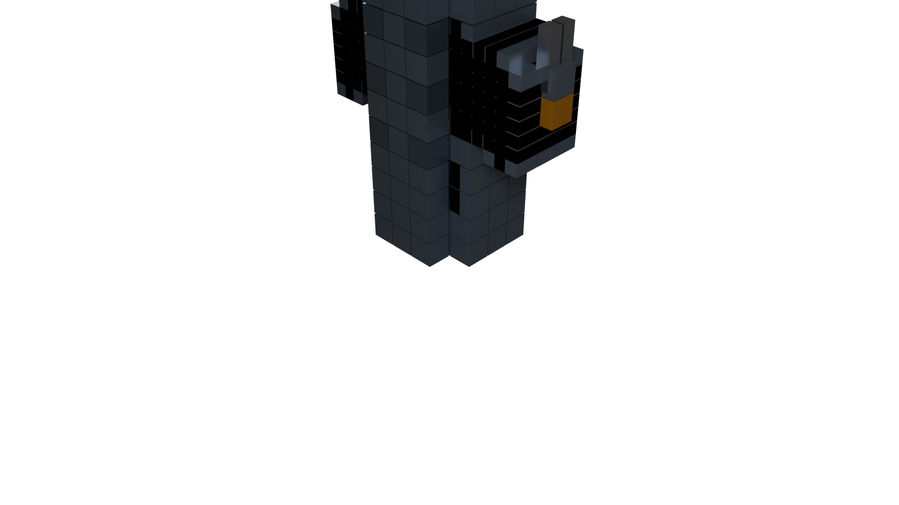

# Voxel Star Fighter 🚀

A voxel-style 3D spaceship created in Blender using Python scripting and refined through **10 iterations**.

**[🌐 Live 3D Viewer →](https://arrakistacos.github.io/voxel-star-fighter/)**



## 🎮 Interactive Viewer

Click the link above to view the star fighter in your browser! Features:
- **Orbit controls** - Click and drag to rotate
- **Auto-rotate** - Toggle smooth rotation
- **Wireframe mode** - See the underlying voxel structure
- **Bloom effects** - Engine glow post-processing
- **Responsive design** - Works on mobile and desktop

## 📊 Model Stats

| Stat | Value |
|------|-------|
| Voxels | 713 |
| Materials | 7 |
| Vertices | ~4,278 |
| Refinements | 10 |

## 🎨 Design Features (10 Refinements)

1. **Detailed Fuselage** - Extended body with panel lines
2. **Advanced Nose** - Progressive taper with detailed tip
3. **Extended Wings** - Angled design with span-based depth
4. **Wing Details** - Edge accents and structural details
5. **Weapon Systems** - Wing-mounted twin cannons
6. **Twin Engines** - Blue nacelles with emission glow
7. **Engine Glow** - Inner thruster effects
8. **Stabilizers** - Vertical tail fins
9. **Surface Details** - Rear vents, antenna, side thrusters
10. **Materials** - PBR materials with metallic/roughness

## 🛠️ Technical Details

- **Software**: Blender 4.2.3 LTS
- **Scripting**: Python (bpy)
- **Renderer**: Cycles (256 samples, denoised)
- **Export**: glTF 2.0 for Three.js
- **Viewer**: Three.js with post-processing bloom
- **Lighting**: 4-point studio setup + emission effects

## 📁 File Structure

```
├── index.html                  # Three.js viewer (GitHub Pages)
├── _config.yml                 # Jekyll config
├── starfighter.gltf           # 3D model for web
├── starfighter.bin            # Binary geometry data
├── voxel_starfighter.blend    # Source Blender file
├── voxel_starfighter.png      # Render output
├── create_refined_starfighter.py  # Python generation script
└── README.md                   # This file
```

## 🚀 Usage

### View Online
Simply visit: `https://arrakistacos.github.io/voxel-star-fighter/`

### Local Development
```bash
# Serve locally for development
python -m http.server 8000
# Open http://localhost:8000
```

### Blender
Open `voxel_starfighter.blend` to modify the source model.

---

**[View on GitHub](https://github.com/arrakistacos/voxel-star-fighter)**
