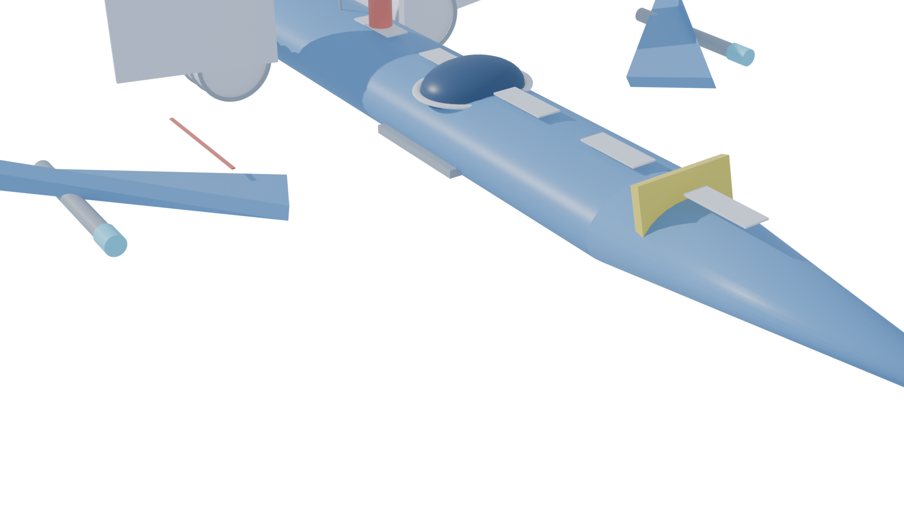

# 🚀 OpenClaw 3D Model Viewer

A reusable, modular Three.js viewer for showcasing 3D models created with Blender. Features multiple star fighter designs with anime and voxel styles.

**[🌐 Live 3D Viewer →](https://arrakistacos.github.io/voxel-star-fighter/)**



---

## 🎨 Featured Models

### Anime Star Fighter (Latest)
Low-poly anime/mecha style with toon shaders and smooth surfaces.

- **Style**: Anime / Mecha inspired
- **Refinements**: 10 iterations
- **Polygons**: ~800
- **Materials**: 7 (toon-shaded)

**Design Features:**
- Streamlined fuselage with anime proportions
- Pointed nose cone with V-fin detail
- Bubble canopy cockpit
- Angular swept wings
- Dual thruster engines with glow
- Wing-mounted cannons
- Toon shader materials

### Voxel Star Fighter (Original)
Cube-based voxel construction with PBR materials.

- **Style**: Voxel Art
- **Refinements**: 10 iterations
- **Voxels**: 713
- **Materials**: 7

---

## 🎮 Interactive Viewer Features

- **Orbit Controls** - Click and drag to rotate around the model
- **Auto-Rotate** - Smooth automatic rotation toggle
- **Wireframe Mode** - View underlying mesh structure
- **Bloom Effects** - Post-processing glow for engines/lights
- **Model Switcher** - Toggle between different designs
- **Responsive Design** - Works on mobile and desktop

---

## 🛠️ Adding New Models

This viewer is designed to be reusable. To add a new model:

1. **Export your model from Blender:**
   ```python
   bpy.ops.export_scene.gltf(
       filepath="models/my_model.gltf",
       export_format='GLTF_SEPARATE',
       export_materials='EXPORT'
   )
   ```

2. **Add to the MODELS database in `index.html`:**
   ```javascript
   const MODELS = {
       'my-model': {
           name: 'My Awesome Model',
           tag: 'Category',
           path: 'models/my_model.gltf',
           cameraPos: [10, 7, 10],  // Adjust for your model size
           stats: {
               style: 'Description',
               polys: '~1000',
               materials: 5
           },
           features: [
               'Feature 1',
               'Feature 2',
               'Feature 3'
           ],
           bloom: { strength: 0.4, radius: 0.3, threshold: 0.8 }
       }
   };
   ```

3. **Push to GitHub** - The viewer will automatically show the new model in the selector.

---

## 📁 Repository Structure

```
voxel-star-fighter/
├── index.html                    # Main viewer (multi-model)
├── viewer/
│   └── ModelViewer.js           # Reusable viewer module (optional)
├── models/
│   ├── starfighter_anime.gltf   # Anime style model
│   ├── starfighter_anime.bin    # Binary data
│   └── ...                      # Future models go here
├── starfighter.gltf             # Original voxel model
├── starfighter.bin              # Voxel binary data
├── preview_anime.png            # Anime model render
├── voxel_starfighter.png        # Voxel model render
├── starfighter_anime.blend      # Anime Blender source
├── voxel_starfighter.blend      # Voxel Blender source
├── create_anime_starfighter.py  # Anime generation script
├── create_refined_starfighter.py # Voxel generation script
├── README.md                    # This file
└── _config.yml                  # GitHub Pages config
```

---

## 🔧 Technical Details

### Anime Star Fighter
- **Software**: Blender 4.2.3 LTS
- **Scripting**: Python (bpy)
- **Renderer**: Cycles (256 samples)
- **Export**: glTF 2.0
- **Style**: Low-poly with toon shaders
- **Lighting**: Anime-style 3-point + rim

### Voxel Star Fighter
- **Software**: Blender 4.2.3 LTS
- **Scripting**: Python (bpy) with voxel generation
- **Renderer**: Cycles (256 samples)
- **Export**: glTF 2.0
- **Style**: Cube-based voxel art
- **Lighting**: 4-point studio setup

### Viewer Stack
- **Framework**: Three.js r160
- **Post-processing**: EffectComposer + UnrealBloomPass
- **Controls**: OrbitControls
- **Loader**: GLTFLoader
- **Hosting**: GitHub Pages

---

## 🚀 Usage

### View Online
Visit: `https://arrakistacos.github.io/voxel-star-fighter/`

### Local Development
```bash
# Clone and serve locally
git clone https://github.com/arrakistacos/voxel-star-fighter.git
cd voxel-star-fighter
python -m http.server 8000
# Open http://localhost:8000
```

### Blender Development
Open the `.blend` files to modify source models:
- `starfighter_anime.blend` - Anime style
- `voxel_starfighter.blend` - Voxel style

---

## 📝 Future Enhancements

- [ ] Draco compression for smaller files
- [ ] Animation support (transforms, camera paths)
- [ ] AR/VR viewing mode
- [ ] Screenshot/download button
- [ ] Material inspector
- [ ] Loading progress bar
- [ ] Lazy loading for multiple models

---

**[View on GitHub](https://github.com/arrakistacos/voxel-star-fighter)**

Created with ❤️ using Blender + Three.js